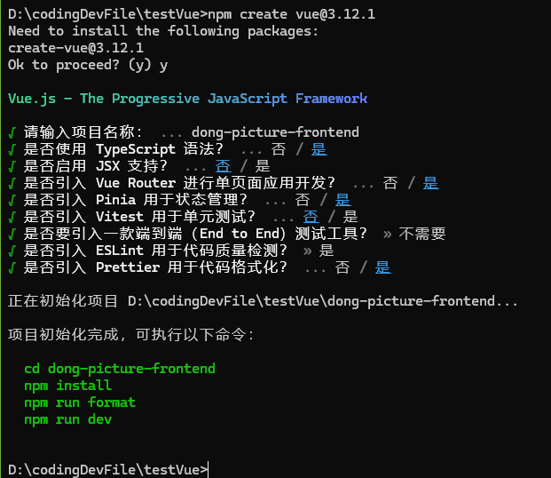
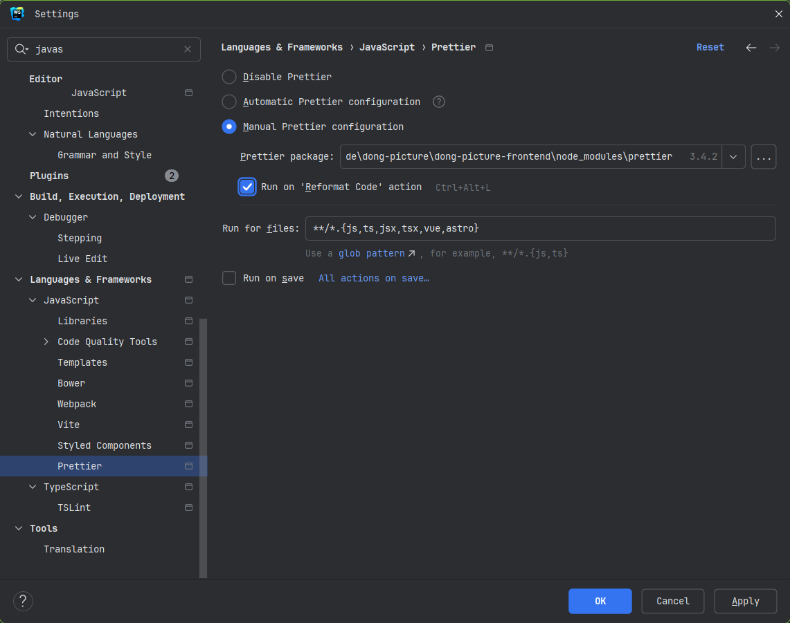
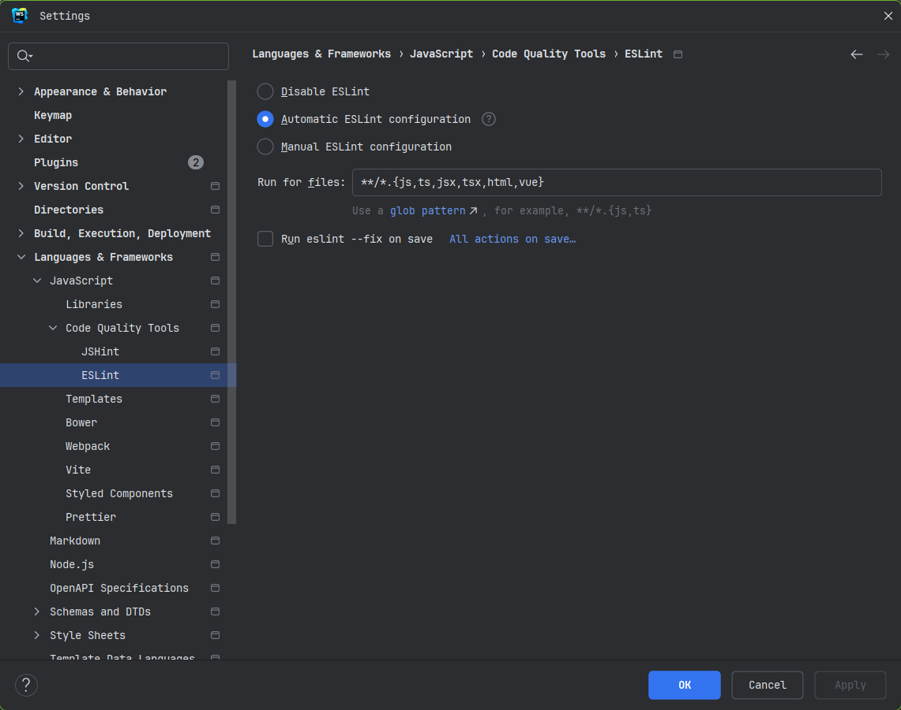
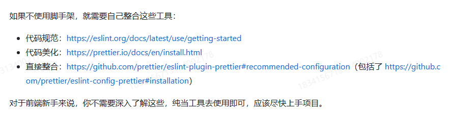

## 安装
通过使用vue官网提供的方法来创建前端项目基础框架



### 安装依赖

```
npm install
npm run dev
```

然后打开页面

### 配置美化



### 关闭校验
为了开发效率更高，你可能想关闭由于 ESLint 校验导致的编译错误，同样可以在开发工具中禁用 ESLint：

可以在这里关闭



### 其他


## 引入组件库


