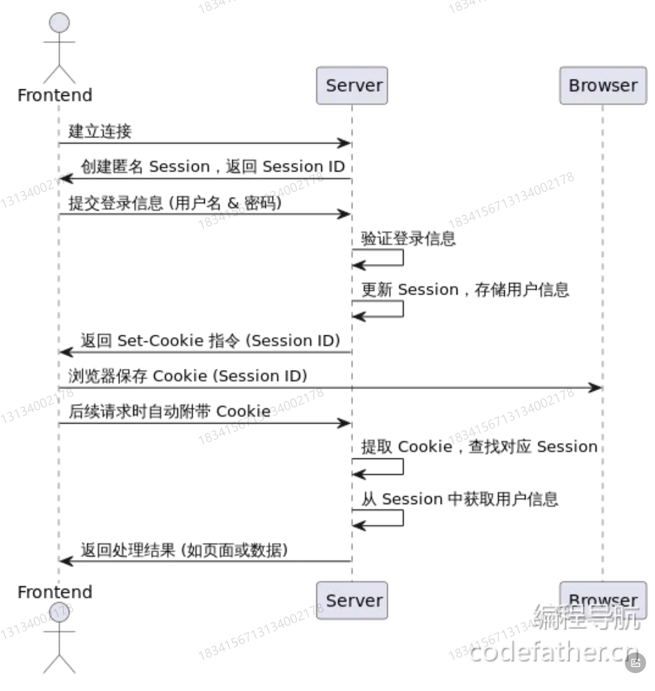
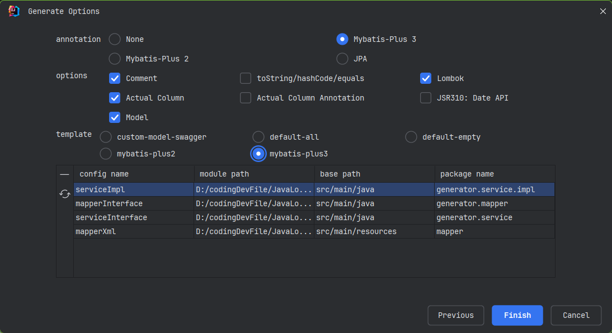
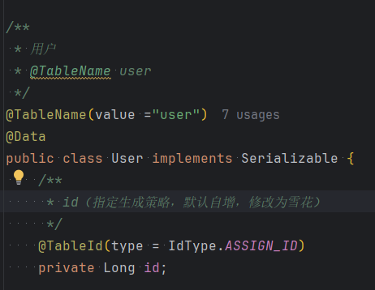
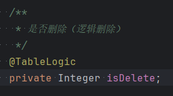

## 用户登录流程

### 建立会话

前端和服务器建立连接后，服务器会为客户端创建一个初始的匿名session，
并将其状态保存下来。

这个session的ID会做为唯一标识，返回给前段

### 登录成功

用户输入用户名和密码提交到后端进行验证，后端会更新用户的session，
将用户的登录信息保存到与该session关联的存储中，同时，服务器也会生成一个
Set-Cookie的响应头，指示前端保存该用户的Session ID。

### 前端保存cookie

前端收到响应后，浏览器会根据set-cookie的指令，将sessionID存储到浏览器的cookie中

并且和当前域名进行绑定

### 前端请求-带cookie的请求

后续前端向相同的域名服务器发送请求的时候，浏览器会自动请求投中附带的之前保存的cookeie
其中就包含了sessionID

### 后端验证

服务器接收到请求后，从请求头中取出sessionID，就可以找到对应的session数据

### 获取存储的信息

后端通过该session获取之前存储的用户信息，从而识别用户的身份执行对应业务逻辑

## 流程图



## 权限校验

1.未登录也可以使用
2.登录用户才能使用
3.未登录也可以使用,但是登录用户能进行更多操作(比如登录后直看全文
4.仅管理员才能使用

### 实现方法
传统的权限控制方法是,在每个接口内单独编写逻辑:先获取到当前登录用户信息,然后判断
用户的权限是否符合要求。
这种方法最灵活,但是会写很多重复的代码,而且其他开发者无法一眼得知接口所需要的权
限。

权限校验其实是一个比较通用的业务需求,一般会通过 **SpringAOP切面+自定义权限校验注解**
实现统一的接口拦截和权限校验;如果有特殊的权限校验验逻辑,再单独在接口中编码。

如果需要更复杂更灵活的权限控制,可以引入Shiro/SpringSecurity/Sa-Token等专门
的权限管理框架。

## 后端开发

### 根据数据表生成代码



### 调整实体类代码

#### ID
首先数据表的ID是默认自增生成，可以更换ID生成策略为雪花算法



#### 逻辑删除

逻辑删除是防止数据被误删，实际数据不会被删除，而是设置一个删除标志
使用注解进行标记




### 用户功能

用户注册

用户登录

获取当前登录用户信息

用户注销

用户权限控制：注解实现

具体功能可以查看对应代码


### 用户管理

管理员功能

- 创建用户
- 删除用户
- 更新用户
- 获取用户列表
- 获取用户详情（未脱敏）

普通用户功能

- 获取用户信息（脱敏）

## 分页修复

由于mybatis插件分页的使用方式发生变化，所以此处需要额外引入分页插件
```xml
<!-- MyBatis Plus 分页插件 -->
<dependency>
    <groupId>com.baomidou</groupId>
    <artifactId>mybatis-plus-jsqlparser-4.9</artifactId>
</dependency>


<dependencyManagement>
    <dependencies>
        <dependency>
            <groupId>org.springframework.boot</groupId>
            <artifactId>spring-boot-dependencies</artifactId>
            <version>${spring-boot.version}</version>
            <type>pom</type>
            <scope>import</scope>
        </dependency>
        <dependency>
            <groupId>com.baomidou</groupId>
            <artifactId>mybatis-plus-bom</artifactId>
            <version>3.5.9</version>
            <type>pom</type>
            <scope>import</scope>
        </dependency>
    </dependencies>
</dependencyManagement>

```

