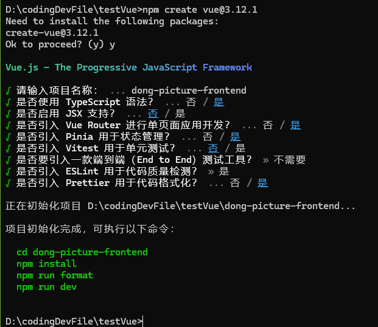

## 安装
通过使用vue官网提供的方法来创建前端项目基础框架



### 安装依赖

```
npm install
npm run dev
```

## 代码

### index.html

这个是页面的基本信息

可以存储页面在浏览器中标签里面的icon和标题

### 全局通用布局

在layouts目录下新建一个布局Basiclayout.vue,在App.vue全局页面入口文件中引入。

具体可以查看globallayout.vue等相关的代码


